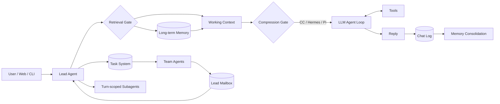
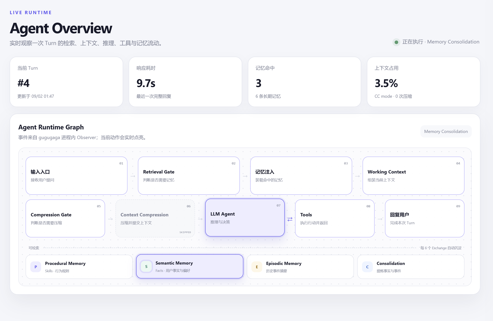
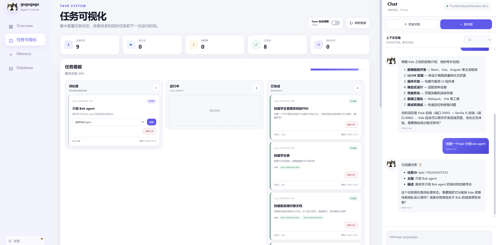
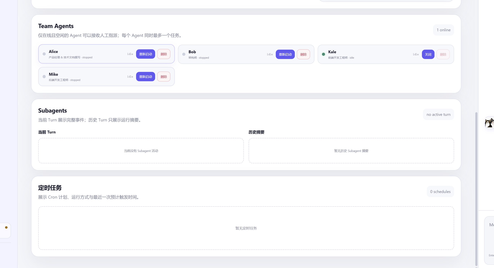

# gugugaga

gugugaga 是一个面向单用户、本地 Workspace 的 Agent Runtime。它将主 Agent、Task System、Team Agent、Subagent、长期记忆、上下文压缩、工具执行和本地 Web Console 放在同一个可观察、可恢复的运行环境中。

当前项目的核心目标不是简单增加工具数量，而是建立一套清晰的协作语义：用户知道谁在工作、任务由谁负责、消息是否送达、运行中如何干预，以及失败后系统如何恢复。

> [!IMPORTANT]
> 项目仍处于开发阶段，适合本地实验和架构验证，不应直接作为多租户服务或暴露到公网。

## 当前能力

| 模块 | 状态 | 说明 |
|---|---|---|
| 主 Agent | 可用 | 多轮 Tool Calling、权限控制、会话恢复和运行事件记录 |
| Web Console | 可用 | Overview、任务看板、Memory、Database、历史对话和本地配置 |
| Task System | 可用 | 持久化任务、依赖、手动分配、自动领取、队列和安全删除 |
| Team Agent | 可用 | 多成员并行、每个 Agent 同时一个任务、停止、重启、删除和工作详情 |
| Lead Mailbox | 可用 | claim/ack/nack、遗留 inflight 恢复、dead-letter 和未读唤醒 |
| Subagent | 可用 | Turn 内并发、权限审批、取消、超时、当前 Turn 事件和历史摘要 |
| 用户干预 | 可用 | 对主 Agent 和 Team Agent 使用 `steer`、`queue`、`redirect`、`stop` |
| Context Modes | 可用 | CC、Hermes、Pi；每个会话创建时选择并锁定 |
| Memory | 可用 | 显式事实、后台整合、语义记忆、情景记忆、审计、更新和遗忘 |
| Web Search | 可选 | 配置 Tavily 后注册 `web_search` |

完整测试基线：`264 passed`。

## 运行模型



主 Agent 在 Team System 中同时承担 Lead 角色，协议 ID 固定为 `lead`。`Lead`、`Leader` 和 `main` 都会在通信层规范化为同一个收件人，不会被当成普通 Team Agent。

## Web Console

Web Console 是推荐入口，主要页面包括：

- **Agent Overview**：只展示主 Agent 当前 Turn 的输入、检索、压缩、LLM、Tools 和回复阶段。Team Agent 和 Subagent 不会点亮主 Agent 流程图。
- **任务可视化**：展示任务状态、依赖、负责人、Team 自动领取开关、Team Agent 卡片和 Subagent 状态。
- **Team Agent 详情**：查看当前任务、活动摘要、工具事件、干预队列和历史工作记录。
- **Memory**：查看 Procedural、Semantic 和 Episodic Memory，并执行搜索、更新和遗忘。
- **Database**：只读浏览本地 SQLite 表、字段、索引和记录。
- **Chat**：创建会话、查看历史、恢复旧会话并选择上下文压缩模式。
- **Settings**：配置主模型、Memory Consolidation 模型、SiliconFlow Key 和 Tavily Key。

Web Console 使用本地 HTTP Server，不依赖前端构建步骤。

### 界面导览

以下截图来自本地 Web Console。任务、成员、模型名称和统计数字只是示例，实际内容来自启动时指定的 Workspace。

#### 1. Agent Overview：观察主 Agent 的一次 Turn



Agent Overview 用于观察主 Agent，而不是整个 Agent Team 的混合状态：

- 顶部指标显示当前 Turn、最近响应耗时、记忆命中数和上下文占用比例；
- Runtime Graph 按顺序展示输入、Retrieval Gate、记忆注入、Working Context、Compression Gate、LLM、Tools 和回复；
- 当前执行阶段使用高亮显示，跳过压缩等分支会保留明确状态；
- 下方区分 Procedural、Semantic、Episodic 和 Consolidation，展示记忆检索与后台沉淀过程；
- Team Agent 和 Subagent 有独立的可视化区域，不会点亮这里的主 Agent 流程图。

#### 2. Task System：创建、分配和跟踪工作



任务页面将对话和工作调度放在同一个界面中：

- 顶部统计全部、进行中、被阻塞、已完成和定时任务；
- Workspace 的“Team 自动领取”开关决定由空闲成员自动领取，还是由用户手动分配；
- 看板按待处理、进行中和已完成分栏，任务卡片展示描述、依赖、负责人和更新时间；
- 手动模式下，用户在待处理卡片中选择在线且空闲的 Team Agent，再点击“指派”；
- 运行中的任务禁止删除，被其他任务依赖的任务也不能删除；
- 右侧 Chat 可以让 Lead 创建任务、解释依赖和汇总结果，但不会绕过用户选择的分配模式。

#### 3. Team Agent、Subagent 与定时任务



任务页下半部分展示三种不同生命周期的执行单元：

- **Team Agents**：长期在线成员。卡片展示名称、角色、运行状态和当前任务；用户可以关闭、重启或删除符合条件的成员；
- 点击 Team Agent 卡片可以打开工作详情，查看当前任务、活动摘要、工具事件、历史记录和用户干预；
- **Subagents**：只属于主 Agent 当前 Turn。当前 Turn 展示完整活动事件，历史 Turn 只保留摘要；
- **定时任务**：展示 Cron 计划、运行方式和预计触发时间，与普通 Task 状态分开管理；
- 在线人数只统计正在运行的 Team Agent，stopped 成员仍保留角色和 Prompt，可由用户重新启动。

## Task System 与 Team Agent

### Task 分配

Workspace 具有一个 Team 自动领取总开关：

- **关闭**：任务只能由用户在任务看板中手动分配给在线且空闲的 Team Agent。
- **开启**：空闲 Team Agent 可以自动领取满足依赖条件的待处理任务。

每个 Team Agent 同时最多执行一个任务。Team Agent 总数没有硬编码上限，但实际并发受本机线程、内存和模型 API 限制。

Task System 是工作分配的唯一权威来源。创建 Team Agent 只代表该成员上线，不代表它已经获得任务。

### 生命周期

用户可以从 Web Console 主动：

- 停止运行中的 Team Agent；
- 重启 stopped Team Agent；
- 删除 stopped 且没有未完成任务的 Team Agent；
- 删除 pending/completed 且没有被其他任务依赖的 Task。

运行中或 stopping 的 Team Agent 不能删除；`in_progress` Task 不能删除。删除 Agent 配置不会抹除历史审计、消息和已完成任务记录。

### Lead Mailbox

Team Agent 使用持久化邮箱向 Lead 汇报结果：

```text
mailbox.jsonl
    │ claim（原子改名）
    ▼
.inflight.jsonl
    ├── 成功 → ack  → 删除 inflight
    └── 失败 → nack → 放回 mailbox
```

该机制提供“至少一次处理”基础：

- `result`、`error` 和 `plan_approval_request` 会产生未读事件；
- Lead 空闲时，未读事件可以触发新的处理循环；
- Web 和 CLI 使用同一套 Lead inbox 注入逻辑；
- 成功处理后才 ACK；
- 无法解析的行进入 dead-letter；
- 启动时可以恢复遗留 inflight 和旧的 `Leader/main` 别名邮箱；
- 原始 `<team-inbox>` JSON 只作为内部上下文，不显示为聊天气泡。

## Subagent

Subagent 是主 Agent 当前 Turn 内的结构化子工作，不是长期在线成员：

- 默认最多同时运行 4 个；
- 可以并行读取、搜索和分析；
- Bash、写入和编辑需要审批；
- 主 Turn 结束前，所有 Subagent 必须进入终态；
- 当前 Turn 展示完整活动事件，历史 Turn 只保留摘要；
- Subagent 不直接拥有 Task System 中的任务。

Team Agent 适合持续在线、由任务看板调度的成员；Subagent 适合当前 Turn 内临时拆分的并行工作。

## 运行中干预

用户必须明确选择干预语义，系统不会猜测新消息与当前任务的关系：

| 动作 | 语义 |
|---|---|
| `steer` | 将补充要求注入当前执行；暂时无法注入时转为 pending message |
| `queue` | 当前任务结束后，在新 Turn 执行独立任务；Team Agent queue 会创建可见 Task |
| `redirect` | 修正当前方向；LLM 阶段可取消并重发，工具阶段等待工具结束后注入 |
| `stop` | 强制停止当前目标；用于必须终止正在运行工具的情况 |

CLI 示例：

```text
/steer main 补充输出风险清单
/queue main 完成后再生成部署文档
/redirect team:Alice 不要使用 React，改成原生 HTML
/stop team:Alice
```

## Context Modes

每个新会话可以选择一种上下文处理方式：

- `cc`：分层处理大型工具结果、旧工具结果和历史中段，必要时生成摘要。
- `hermes`：保留会话开头和近期尾部，对中间历史持续合并摘要。
- `pi`：根据 Token 预算寻找工具协议安全切点，并生成 Compaction Entry。

模式只能在空白会话开始前选择，首条消息发出后锁定。

## 当前 Memory 实现

长期记忆分为：

- **Procedural Memory**：Skills 和行为规则；
- **Semantic Memory**：稳定的用户事实、偏好、长期目标和约束；
- **Episodic Memory**：已经完成的重要事件、决定和里程碑。

写入通道：

1. 用户明确要求“记住”时，主 Agent 调用 `save_note`；
2. 完整 Exchange 进入 `chat_log` 后，后台按批次执行 Memory Consolidation。

当前实现具备凭据遮蔽、严格 JSON 校验、重要度阈值、重复检测、更新/替代、遗忘、租约、失败重试和审计记录。召回目前主要依据中文字符与英文 Token 的词面重合，并受 Token 预算限制。

## 快速开始

### 环境要求

- Python 3.11+
- 支持 Tool Calling 的 SiliconFlow 模型
- 可选 Tavily API Key

### 安装

```powershell
$projectDir = "C:\path\to\gugugaga"
Set-Location $projectDir

python -m venv .venv
.\.venv\Scripts\python.exe -m pip install -r requirements.txt
.\.venv\Scripts\python.exe -m pip install -e ".[test]"
```

### 在指定 Workspace 启动 Web

```powershell
$projectDir = "C:\path\to\gugugaga"
$workspaceDir = "C:\path\to\your-workspace"
Set-Location $projectDir

.\.venv\Scripts\python.exe -m gugugaga.web `
  --workspace $workspaceDir `
  --host 127.0.0.1 `
  --port 8765
```

打开：<http://127.0.0.1:8765>

Web 可以在未配置模型时启动。点击左下角配置按钮填写主模型、SiliconFlow API Key、可选的 Consolidation 模型和 Tavily Key。

配置保存在目标 Workspace 的：

```text
.gugugaga/web_config.json
```

### 使用环境变量

```powershell
$env:SILICONFLOW_API_KEY = "your-key"
$env:SILICONFLOW_MODEL = "Qwen/Qwen3-Coder-30B-A3B-Instruct"
$env:GUGUGAGA_MEMORY_CONSOLIDATION_MODEL = "Qwen/Qwen3-8B"
$env:TAVILY_API_KEY = "tvly-your-key"

$workspaceDir = "C:\path\to\your-workspace"
.\.venv\Scripts\python.exe -m gugugaga.web --workspace $workspaceDir
```

### 启动 CLI

```powershell
$workspaceDir = "C:\path\to\your-workspace"
.\.venv\Scripts\python.exe -m gugugaga --workspace $workspaceDir
```

指定 Context Mode：

```powershell
.\.venv\Scripts\python.exe -m gugugaga --workspace $workspaceDir --context-mode hermes
.\.venv\Scripts\python.exe -m gugugaga --workspace $workspaceDir --context-mode pi
```

常用 CLI 命令：

```text
/help
/status
/tasks
/team
/memory status
/memory list
/memory search <text>
/memory show <id>
/memory update <fact_id> <new text>
/memory forget <id>
/memory retry
/exit
```

## 配置

### Provider

| 环境变量 | 必需 | 默认值 | 说明 |
|---|---:|---|---|
| `SILICONFLOW_API_KEY` | CLI 必需 | — | SiliconFlow API Key |
| `SILICONFLOW_MODEL` | CLI 必需 | — | 主模型 |
| `SILICONFLOW_BASE_URL` | 否 | `https://api.siliconflow.cn/v1` | OpenAI 兼容地址 |
| `SILICONFLOW_FALLBACK_MODEL` | 否 | — | Provider 失败时的候选模型 |
| `TAVILY_API_KEY` | 否 | — | 配置后启用 `web_search` |

### Runtime

| 环境变量 | 默认值 | 说明 |
|---|---:|---|
| `GUGUGAGA_MAX_ROUNDS` | `40` | 单 Turn 最大 Agent Loop 轮数 |
| `GUGUGAGA_MAX_TOKENS` | `8192` | 单次模型输出上限 |
| `GUGUGAGA_IDLE_POLL` | `1` | CLI 空闲轮询间隔（秒） |
| `GUGUGAGA_IDLE_TIMEOUT` | `30` | CLI 空闲等待超时（秒） |

### Memory

| 环境变量 | 默认值 | 说明 |
|---|---:|---|
| `GUGUGAGA_MEMORY_ENABLED` | `true` | Memory 总开关 |
| `GUGUGAGA_MEMORY_EXPLICIT_ENABLED` | `true` | 显式记忆开关 |
| `GUGUGAGA_MEMORY_CONSOLIDATION_ENABLED` | `true` | 后台整合开关 |
| `GUGUGAGA_MEMORY_CONSOLIDATION_EXCHANGES` | `6` | 每批 Exchange 数量 |
| `GUGUGAGA_MEMORY_CONSOLIDATION_MODEL` | 主模型 | 整理记忆使用的模型 |
| `GUGUGAGA_MEMORY_CONSOLIDATION_TIMEOUT` | `30` | 单次整合超时（秒） |
| `GUGUGAGA_MEMORY_CONSOLIDATION_LEASE` | `600` | 整合租约（秒） |
| `GUGUGAGA_MEMORY_CONSOLIDATION_MAX_FACTS` | `10` | 单批最大事实候选数 |
| `GUGUGAGA_MEMORY_CONSOLIDATION_MIN_IMPORTANCE` | `0.8` | 长期记忆最低重要度 |
| `GUGUGAGA_MEMORY_RECALL_TOKENS` | `2000` | 单次召回 Token 预算 |

## 本地数据

所有运行状态都位于用户选择的 Workspace：

```text
<workspace>/
├── .gugugaga/
│   ├── state.db                 # Chat、Facts、Episodes、Consolidation、Audit
│   ├── web_config.json          # Web 本地配置和密钥
│   ├── traces/YYYY-MM-DD.jsonl  # 结构化运行事件
│   ├── usage.jsonl              # 模型和 Token 使用记录
│   ├── team-agents.json         # Team Agent 持久化配置
│   ├── team-settings.json       # Workspace Team 自动领取设置
│   └── agent-interactions.json  # steer/queue/redirect/stop 状态
├── .tasks/                      # Task System JSON 状态
├── .mailboxes/                  # Team Agent 与 Lead 邮箱
├── .transcripts/                # 上下文模式会话记录
├── .memory/                     # 兼容 Memory 文件
├── .task_outputs/               # 大型工具结果
├── .scheduled_tasks.json        # Cron 持久化状态
└── skills/                      # Workspace Skills
```

## 测试

测试使用 Fake Provider 和确定性输入，不需要真实 API Key：

```powershell
.\.venv\Scripts\python.exe -m pytest -q
.\.venv\Scripts\python.exe -m compileall -q gugugaga
.\.venv\Scripts\python.exe -m gugugaga --help
.\.venv\Scripts\python.exe -m gugugaga.web --help
```

## 下一阶段：加强 Agent Memory

下一阶段优先增强记忆系统。目标不是“记得更多”，而是做到：**召回更准、来源可追踪、冲突可处理、用户可纠正、效果可评测**。

### P0：召回质量与可解释性

- 建立独立的 Memory Recall 评测集，覆盖中文同义表达、跨会话偏好、长期目标、无关记忆和冲突事实。
- 移除“完全无匹配时返回最近三条”的默认行为，避免无关记忆污染回答。
- 引入混合召回：词面/FTS 检索、可选向量检索、时间衰减、重要度和重复出现次数共同排序。
- 为中文查询增加更合理的分词或 n-gram 策略，不再只依赖单字重合。
- 每条注入记忆携带 `memory_id`、来源 Turn、写入方式、更新时间和召回分数。
- 在 Web 中显示“为什么召回这条记忆”，便于定位错误召回。

### P1：生命周期与冲突处理

- 增加 `confidence`、`valid_from`、`valid_until`、`last_accessed_at` 和 `access_count`。
- 对相同 subject 的矛盾事实建立明确状态机：active、conflicted、superseded、forgotten。
- 区分“用户明确修正”“模型推断变化”和“事实自然过期”，避免新事实静默覆盖旧事实。
- 对重复事实进行聚类合并，同时保留 provenance 和 seen count。
- 让 `forget` 在下一次召回立即生效，并验证缓存、摘要和历史恢复不会重新注入已遗忘内容。

### P2：整合可靠性与用户控制

- Consolidation 使用稳定的幂等键，补充崩溃恢复、Provider 超时和重复提交测试。
- 将“事实提取”和“是否值得长期保存”拆成两个可测阶段。
- Web Memory 页面增加固定、编辑、确认冲突、批量遗忘、导出和审计时间线。
- 增加 Workspace Memory 导入/导出格式，并对敏感字段执行统一遮蔽。

### 验收标准

- 无相关记忆时不注入任何长期记忆。
- 每条召回结果都能追踪到来源和排名原因。
- 用户修正事实后，新事实生效且旧事实不再作为 active 召回。
- 用户遗忘后，下一个 Turn 不再注入该记忆。
- Consolidation 重试不会产生重复事实或重复情景。
- Recall 和 Consolidation 都有确定性测试、质量评测和可观察指标。

## 已知限制

- 仍是单用户、本地运行模型，不支持多租户隔离。
- Team Agent 数量没有资源配额，需要由使用者控制并发规模。
- Mailbox 提供至少一次处理，不保证 exactly-once；消费者必须依赖消息 ID 处理重复投递。
- Bash 权限较大，生产化前仍需要更严格的进程和文件系统沙箱。
- Context 压缩和 Memory Consolidation 会调用远程模型，应根据数据隐私要求决定是否启用。
- 尚未完成长时间运行、进程崩溃、磁盘写满和高并发故障注入。

## 项目结构

```text
gugugaga/
├── __main__.py          # CLI、Runtime 构建、Lead inbox 循环
├── agent.py             # 主 Agent Loop 与 Turn 处理
├── provider.py          # SiliconFlow Provider
├── tools.py             # 主 Agent 工具定义和注册
├── context.py           # Working Context
├── context_modes.py     # CC、Hermes、Pi
├── memory/              # Repository、Service、Validation
├── tasks.py             # Task System
├── interactions.py      # steer、queue、redirect、stop
├── subagents.py         # Turn 内 Subagent
├── teams.py             # Team Agent、Lead identity、Mailbox
├── permissions.py       # 权限策略和审批
├── mutations.py         # Workspace 写协调
├── stateio.py           # 原子写入和跨进程锁
├── observability.py     # Observer、Trace、Usage、Chat Log
├── web.py               # 本地 Web Server 和 API
├── web_config.py        # Web 配置持久化
└── web_assets/          # Web Console
```

## 安全说明

- 不要提交真实 API Key、`.gugugaga/web_config.json` 或 Workspace 私有数据。
- Web 写接口默认只允许回环地址调用，不要直接绑定公网地址。
- Trace 会遮蔽常见 Key、Token、Authorization 和密码字段，但不代表完整的数据防泄漏方案。
- Memory 和远程模型调用可能包含用户对话内容，使用前应确认数据处理与留存要求。
