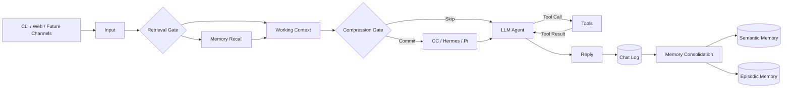

# gugugaga

gugugaga 是一个面向单用户、本地工作空间的 Agent Runtime 原型。项目基于 `learn-claude-code` S20 综合示例拆分和扩展，通过 SiliconFlow 的 OpenAI 兼容接口调用模型，并提供 CLI、Web Console、长期记忆、可替换上下文压缩和工具执行能力。

项目当前重点不是堆叠更多功能，而是把一个 Agent Turn 中的输入、记忆检索、上下文构建、压缩判断、LLM 推理、工具调用、回复和记忆沉淀完整串联起来，并让整个过程可以观察、持久化和调试。

> [!IMPORTANT]
> gugugaga 目前仍是开发中的实验性项目，不是生产级 Agent 平台。核心 Agent Loop、Web Console、Memory、上下文压缩和基础工具已有测试覆盖；Task System、后台任务、定时任务、Subagent 和 Team Agent 虽然已有实现，但尚未完成系统性的并发、恢复、故障注入和长时间运行测试。

## 当前状态

| 模块 | 状态 | 说明 |
|---|---|---|
| Agent Loop | 可用 | 支持模型调用、工具执行、结果回填和多轮循环 |
| Web Console | 可用 | 提供 Overview、Memory、Database 和 Chat |
| 会话系统 | 可用 | 支持新对话、历史记录、查看旧对话和从旧对话继续 |
| Context Modes | 可用 | 支持 CC、Hermes、Pi，会话开始后锁定模式 |
| Memory | 可用 | 支持程序性、语义和情景记忆，以及显式保存和隐式整合 |
| Tavily Web Search | 可用 | 配置 `TAVILY_API_KEY` 后向 Agent 注册 `web_search` |
| Task System | 实验性 | 已有持久化 Task DAG 和任务认领，需要继续做健壮性测试 |
| 后台任务 | 实验性 | 已有后台执行与结果收集，需要完善取消、超时和退出恢复 |
| 定时任务 | 实验性 | 已有 Cron 调度，需要完善时区、去重、错过执行和重启恢复 |
| Subagent | 实验性 | 已有 Turn 内结构化并发、权限审批、取消、超时和失败传播 |
| Team Agent | 实验性 | 已有 Teammate、Mailbox 确认消费、协议持久化和原子任务状态，仍需要长时间故障注入 |
| 钉钉 / 飞书 | 规划中 | 计划通过官方机器人接口接收和回复消息 |
| 语音 | 规划中 | 计划增加语音输入、转写和语音回复能力 |
| LLM-as-a-Judge | 规划中 | 计划作为最终质量评测与回归门禁 |

## 核心流程



模型请求统一经过 `SiliconFlowProvider.create()`。主 Agent、上下文摘要、Memory Consolidation、Subagent 和 Team Teammate 使用相同的消息与工具协议边界。

## 功能概览

### Web Console

Web Console 是当前推荐的使用入口：

- **Overview**：实时显示一次 Turn 的输入、检索、上下文、压缩、LLM、Tools、回复和 Memory Consolidation。
- **Memory**：查看 Procedural、Semantic 和 Episodic 三类记忆。
- **Database**：只读浏览 `.gugugaga/state.db` 的表、字段、记录和索引。
- **Chat**：与同进程 Agent 对话，创建新会话、查看历史会话并从旧会话恢复。
- **Settings**：在前端配置主模型、Memory Consolidation 小模型、SiliconFlow API Key 和 Tavily API Key。

桌面端采用全屏三栏布局，左侧为导航，中间为运行状态或数据页面，右侧为固定聊天区域。每个区域独立滚动，页面切换保留各自位置。

### Context Modes

每个新会话可以选择一种上下文压缩方式：

- `cc`：分层处理大型工具结果、旧工具结果和消息中段，必要时生成摘要。
- `hermes`：保留会话开头和近期尾部，对中间历史进行递进摘要。
- `pi`：按近期 Token 预算寻找工具协议安全的切点，并追加 `CompactionEntry`。

压缩方式只能在空白对话开始前选择。首条消息进入后，该会话的模式会被锁定。

### Memory

gugugaga 将长期记忆分成三类：

- **Procedural Memory**：Skills、行为规则和 Agent 的“做事方式”。
- **Semantic Memory**：长期有效的用户事实、偏好和稳定知识。
- **Episodic Memory**：已经完成的重要事件、决定和里程碑摘要。

记忆有两条写入通道：

1. 用户明确要求“记住”时，Agent 可以调用 `save_note` 立即保存语义事实。
2. 完整 Exchange 写入 `chat_log` 后，系统默认每累计 6 个待处理 Exchange 触发一次后台 Memory Consolidation。

Memory Consolidation 不保证每次都会生成记忆。临时问题、普通问答、调试状态、低重要度信息和进行中的计划应被过滤，不进入 Semantic 或 Episodic Memory。

### Tools

当前主 Agent 可以使用的工具包括：

- `bash`
- `read_file`
- `write_file`
- `edit_file`
- `glob`
- `todo_write`
- `spawn_subagent`
- `check_subagent`
- `wait_subagents`
- `cancel_subagent`
- `review_subagent_permission`
- `load_skill`
- `compact`
- `web_search`
- Task、Cron 和 Team 相关工具

文件工具限制在选定的 workspace 内，并统一使用 UTF-8。`bash` 能力更强，需要由权限 Hook 和运行环境共同约束。

Subagent 在主 Agent 当前 Turn 内异步运行，默认最多同时执行 4 个。主 Agent
可以继续处理独立工作或等待结果，但所有 Subagent 进入 `completed`、`failed`、
`cancelled` 或 `timed_out` 前，本 Turn 不能结束。Subagent 可直接读取、搜索和分析；
`bash`、写入和编辑会进入 `waiting_permission`，由主 Agent 针对准确的请求 ID、
工具及参数审批。终态结果被主 Agent 消费后，Subagent Job 会从活动表自动移除。

主 Agent、Subagent、Team Agent 和后台任务共享 workspace 写协调器。`write_file`
和 `edit_file` 按规范化文件路径加锁；不同文件可以并行，同一文件串行。Bash 应通过
`write_paths` 声明修改目标，无法精确声明时使用 workspace 全局写锁。Subagent 和
Team Agent 修改已有文件前必须读取 SHA-256，并通过 `expected_sha256` 做乐观冲突
检查；提交采用同目录临时文件加原子替换。Subagent 的 300 秒预算在等待锁时继续
计算，若超时时正在写入，只获得一次 30 秒收尾窗口。

Web 运行时的 Bash 风险操作使用本地审批弹窗，只支持“允许一次”或拒绝，默认
120 秒后拒绝。Subagent 的 Bash 请求先由主 Agent 审核，再冒泡到同一个人工审批
通道；审批 ID 单次消费，取消、超时或关闭都会默认拒绝。

## 快速开始

### 1. 环境要求

- Python 3.11 或更高版本
- 可调用 Function Calling / Tool Calling 的 SiliconFlow 模型
- 可选：Tavily API Key，用于 Web Search

### 2. 安装

```powershell
cd E:\AgentLearnProject\gugugaga

python -m venv .venv
.\.venv\Scripts\Activate.ps1

python -m pip install -r requirements.txt
python -m pip install -e ".[test]"
```

### 3. 启动 Web Console

Web Console 可以在尚未配置模型时启动：

```powershell
python -m gugugaga.web --workspace . --port 8765
```

浏览器打开：

```text
http://127.0.0.1:8765
```

点击左下角“配置”，填写：

- 主模型
- Memory Consolidation 小模型，可留空并复用主模型
- SiliconFlow API Key
- Tavily API Key，可选

Web 配置保存在：

```text
.gugugaga/web_config.json
```

该文件已被 `.gitignore` 排除。前端不会回显完整 Key，留空密码字段会保留已有值。

### 4. 使用 PowerShell 环境变量

也可以在启动进程中直接设置：

```powershell
$env:SILICONFLOW_API_KEY = "your-key"
$env:SILICONFLOW_MODEL = "Qwen/Qwen3-Coder-30B-A3B-Instruct"
$env:GUGUGAGA_MEMORY_CONSOLIDATION_MODEL = "Qwen/Qwen3-8B"
$env:TAVILY_API_KEY = "tvly-your-key"

python -m gugugaga.web --workspace . --port 8765
```

程序不会自动读取仓库中的 `.env`。CLI 模式必须在当前进程中提供 `SILICONFLOW_API_KEY` 和 `SILICONFLOW_MODEL`。

### 5. 启动 CLI

```powershell
python -m gugugaga --workspace .
```

指定上下文模式：

```powershell
python -m gugugaga --workspace . --context-mode cc
python -m gugugaga --workspace . --context-mode hermes --context-window-tokens 131072
python -m gugugaga --workspace . --context-mode pi --context-window-tokens 131072
```

常用 CLI 命令：

```text
/help
/status
/tasks
/team
/memory status
/memory list
/memory search <text>
/memory show <id>
/memory update <fact_id> <new text>
/memory forget <id>
/memory retry
/exit
```

## 配置

### Provider

| 环境变量 | 必需 | 默认值 | 说明 |
|---|---:|---|---|
| `SILICONFLOW_API_KEY` | 是 | — | SiliconFlow API Key |
| `SILICONFLOW_MODEL` | 是 | — | 主模型 |
| `SILICONFLOW_BASE_URL` | 否 | `https://api.siliconflow.cn/v1` | OpenAI 兼容接口地址 |
| `SILICONFLOW_FALLBACK_MODEL` | 否 | — | Provider 失败时的候选模型 |
| `TAVILY_API_KEY` | 否 | — | 启用 `web_search` |

### Runtime

| 环境变量 | 默认值 | 说明 |
|---|---:|---|
| `GUGUGAGA_MAX_ROUNDS` | `40` | 单次 Turn 最大 Agent Loop 轮数 |
| `GUGUGAGA_MAX_TOKENS` | `8192` | 单次模型输出上限 |
| `GUGUGAGA_IDLE_POLL` | `1` | 空闲轮询间隔 |
| `GUGUGAGA_IDLE_TIMEOUT` | `30` | 空闲等待超时 |

### Memory

| 环境变量 | 默认值 | 说明 |
|---|---:|---|
| `GUGUGAGA_MEMORY_ENABLED` | `true` | 总记忆开关 |
| `GUGUGAGA_MEMORY_EXPLICIT_ENABLED` | `true` | 显式记忆开关 |
| `GUGUGAGA_MEMORY_CONSOLIDATION_ENABLED` | `true` | 隐式整合开关 |
| `GUGUGAGA_MEMORY_CONSOLIDATION_EXCHANGES` | `6` | 每批待整合 Exchange 数量 |
| `GUGUGAGA_MEMORY_CONSOLIDATION_MODEL` | 主模型 | 整理记忆使用的小模型 |
| `GUGUGAGA_MEMORY_CONSOLIDATION_TIMEOUT` | `30` | 整合请求超时，单位秒 |
| `GUGUGAGA_MEMORY_CONSOLIDATION_LEASE` | `600` | 整合任务租约，单位秒 |
| `GUGUGAGA_MEMORY_CONSOLIDATION_MAX_FACTS` | `10` | 单批最多候选事实数 |
| `GUGUGAGA_MEMORY_CONSOLIDATION_MIN_IMPORTANCE` | `0.8` | 长期记忆最低重要度 |
| `GUGUGAGA_MEMORY_RECALL_TOKENS` | `2000` | 单次记忆召回预算 |

## 本地数据

运行数据默认位于当前 workspace 的 `.gugugaga/`：

```text
.gugugaga/
├── state.db                 # 会话、事实、情景记忆、整合批次和审计记录
├── web_config.json          # Web 配置与本地密钥
├── traces/YYYY-MM-DD.jsonl  # Turn、LLM、Tool、Memory 和 Agent 事件
├── usage.jsonl              # Provider、Model 和 Token 使用记录
├── tasks/                   # Task System 状态
├── memory/                  # 兼容记忆文件
├── mailboxes/               # Team Agent 邮箱
├── transcripts/             # 会话记录
├── outputs/                 # 大型工具输出
└── skills/                  # Workspace Skills
```

Trace 会对常见的密码、API Key、Token 和 Authorization 字段进行遮蔽，但项目仍然是本地开发原型，不应直接暴露到公网。

## 测试

现有测试主要使用 Fake Provider 和确定性输入，不需要真实 API Key，也不会访问真实模型：

```powershell
python -m pytest -q
python -m compileall -q gugugaga
python -m gugugaga --help
python -m gugugaga.web --help
```

当前测试能够验证核心协议、上下文模式、Memory、Web API、文件边界和部分 Agent 协作行为，但尚不能证明系统已经达到生产可靠性。以下测试仍是后续重点：

- 并发竞争和锁顺序
- 重启恢复与幂等执行
- Provider 超时、限流和不合法输出
- 工具取消、进程泄漏和资源回收
- SQLite 锁竞争、事务回滚和数据迁移
- 长时间运行与内存增长
- 多 Agent 消息乱序和任务重复认领
- Cron 错过执行、重复执行和时区边界
- 外部消息平台的重投递、签名校验和去重

## 路线图

### Phase 1：Task、后台任务和定时任务健壮化

- 完善 Task DAG 的依赖校验、并发认领、租约、重试和失败状态。
- 为后台任务增加取消确认、超时、结果持久化和进程退出恢复。
- 为 Cron 增加明确时区、misfire 策略、幂等键、重复执行保护和重启补偿。
- 增加压力测试、故障注入、资源泄漏检查和长时间运行测试。

### Phase 2：Subagent 和 Team Agent

- 为 Subagent 增加独立预算、超时、取消和最小权限工具集。
- 明确父子 Agent 的上下文传递、结果协议和失败传播。
- 完善 Team Agent 的 Mailbox、任务认领、消息顺序、成员生命周期和优雅关闭。
- 增加多 Agent 并发、死锁、重复任务和部分成员失败测试。

### Phase 3：钉钉和飞书

- 抽象统一的 Channel Adapter，不让渠道逻辑进入核心 Agent Loop。
- 优先接入钉钉应用机器人 Stream 模式和飞书机器人长连接/事件订阅。
- 建立渠道用户与 gugugaga `session_id` 的映射。
- 支持“新对话”“查看状态”“恢复会话”等渠道命令。
- 增加消息验签、访问白名单、消息去重、异步队列和失败重试。

### Phase 4：语音能力

- 接收语音消息并下载原始媒体。
- 接入 Speech-to-Text，将转写文本送入现有 Agent Loop。
- 可选接入 Text-to-Speech，把 Agent 回复转换为语音。
- 保存文本会话作为主记录，媒体文件采用独立的生命周期和清理策略。
- 增加长音频、噪声、空转写、重复上传和超时测试。

### Phase 5：LLM-as-a-Judge

- 建立覆盖工具调用、记忆、压缩、Task、多 Agent、渠道和语音的评测集。
- 将确定性测试与 LLM Judge 分离：能用代码断言的行为不交给 Judge。
- 为事实正确性、任务完成度、工具选择、记忆质量、安全性和回答质量定义 Rubric。
- 保存输入、轨迹、工具结果、最终回答、Judge 评分和失败原因。
- 使用固定 Judge 模型、版本化 Prompt、人工校准样本和回归阈值。
- 将 Judge 结果接入持续回归，但不把单次主观评分当作唯一发布依据。

## 当前非目标

- 暂不作为多租户 SaaS 使用。
- 暂不直接暴露 Web Console 到公网。
- 暂不承诺 Task、后台任务、Cron、Subagent 和 Team Agent 的生产级可靠性。
- 暂未实现 S18 Worktree Isolation 和 S19 MCP Plugin。
- 暂未接入钉钉、飞书和语音渠道。
- 暂未建立完整的 LLM-as-a-Judge 发布门禁。

## 项目结构

```text
gugugaga/
├── __main__.py          # CLI、Runtime 构建与命令处理
├── agent.py             # Agent Loop
├── provider.py          # SiliconFlow Provider 边界
├── tools.py             # 工具定义和注册
├── context.py           # Context 与历史处理
├── context_modes.py     # CC、Hermes、Pi
├── memory/              # Memory Repository、Service 和 Validation
├── tasks.py             # Task System
├── background.py        # 后台任务
├── cron.py              # 定时任务
├── subagents.py         # Turn 内结构化异步 Subagent
├── teams.py             # Team Agent 与 Mailbox
├── observability.py     # Observer、Trace 和 Usage
├── mutations.py         # workspace 并发写协调与分层锁
├── stateio.py           # 原子状态写入与跨进程文件锁
├── web.py               # 本地 Web Server 与 API
├── web_search.py        # Tavily Search
├── web_config.py        # Web 配置持久化
└── web_assets/          # Overview、Memory、Database、Chat UI
```

## 安全说明

- 不要提交 `.env`、`.gugugaga/web_config.json` 或其他真实密钥文件。
- Web 配置修改默认只接受本机回环地址请求。
- `bash` 可以执行工作空间内外的系统命令，生产化之前需要更严格的沙箱和审批机制。
- Memory Consolidation 会把部分对话发送给远程模型，使用前应确认数据处理和隐私要求。
- 钉钉、飞书和语音接入后，需要单独设计用户身份、权限、媒体留存和审计策略。
