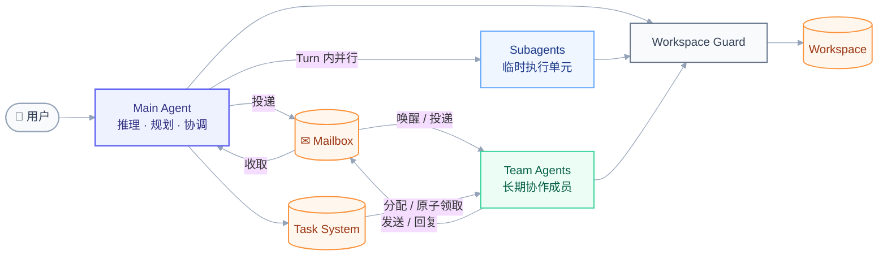
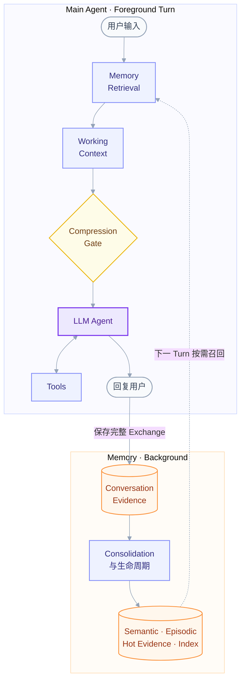
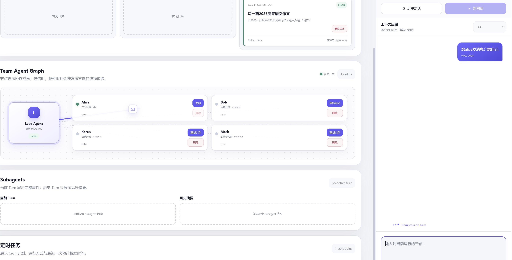
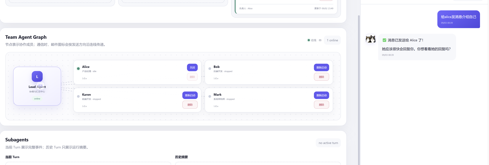
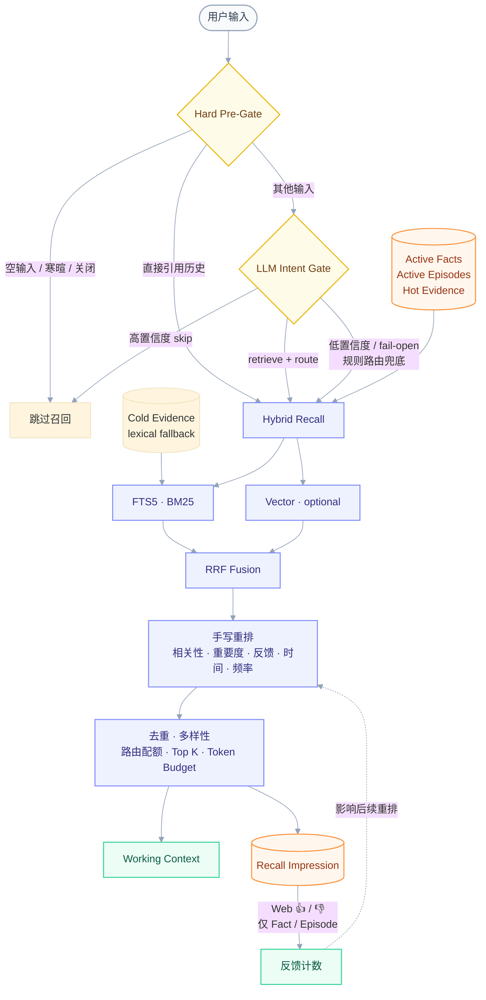
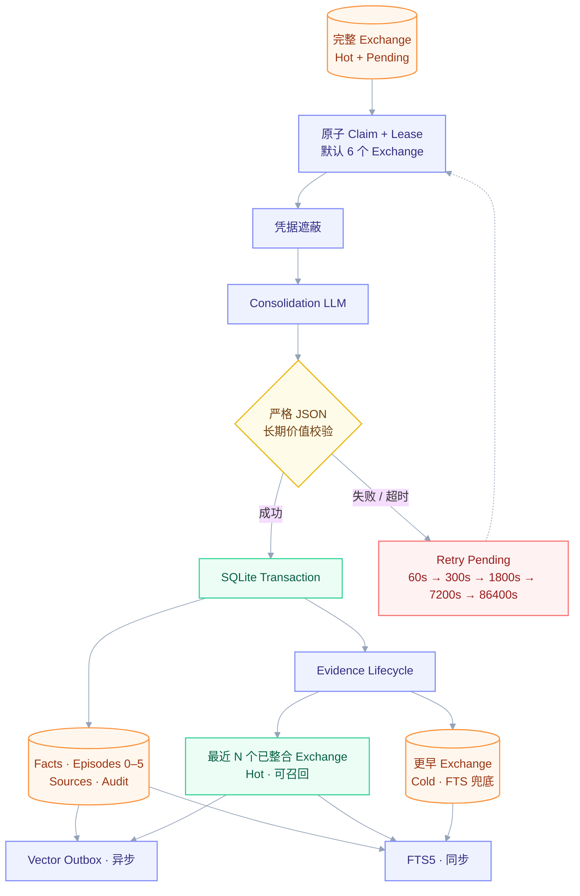

# gugugaga

gugugaga 是一个面向单用户、本地 Workspace 的 Agent Runtime。它把 Main Agent、Turn 内 Subagent、长期在线的 Team Agent、Task System、Mailbox、长期记忆、上下文压缩、工具执行和 Web Console 放进同一套可观察、可恢复的运行环境。

这个项目关注的不只是“Agent 能调用多少工具”，而是把协作语义做清楚：谁负责当前工作、消息是否送达、多个 Agent 如何避免抢到同一任务、并发修改文件时如何发现冲突，以及记忆为什么被召回。

> [!IMPORTANT]
> 项目仍处于开发阶段，适合本地实验和架构验证。它不是多租户服务，也不应直接暴露到公网。

## 当前能力

| 模块 | 状态 | 说明 |
|---|---|---|
| Main Agent | 可用 | 多轮 Tool Calling、规划协调、权限控制、会话恢复和运行事件记录 |
| Web Console | 可用 | Agent Runtime Graph、Task 看板、Team Graph、Memory、Database、历史对话和本地配置 |
| Task System | 可用 | 持久化任务、依赖、手动分配、自动领取、队列和安全删除 |
| Team Agent | 可用 | 长期成员、多成员并行、Mailbox 通信、停止/重启/删除、创建后编辑角色/Prompt/工具 |
| Subagent | 可用 | 当前 Turn 内并发、权限审批、取消、超时、实时事件和历史摘要 |
| Mailbox | 可用 | 普通消息唤醒空闲 Agent、claim/ack/nack、遗留 inflight 恢复和 dead-letter |
| Workspace 并发保护 | 可用 | 并行读取、SHA-256 乐观并发、FIFO 写队列、路径锁/全局锁和原子提交 |
| Context Modes | 可用 | CC、Hermes、Pi；会话开始时选择，首条消息后锁定 |
| Memory | 可用 | Semantic、Episodic、Hot/Cold Conversation Evidence、混合召回、反馈、后台整合和审计 |
| Web Search | 可选 | 配置 Tavily 后注册 `web_search` |

## 架构总览

### 1. Agent 协作架构



这张图强调四条边界：Main Agent 负责对话与协调；Subagent 是当前 Turn 的临时并行执行单元；Team Agent 是可跨 Turn 存活的长期成员；Task System 和 Mailbox 分别承载“工作归属”和“消息投递”，两者不能互相替代。所有执行单元最终都通过同一个 Workspace Guard 访问文件，避免各自实现一套不一致的并发规则。

Main Agent 在 Team System 中使用固定协议身份 `lead`。`Lead`、`Leader` 和 `main` 在通信层都会规范化为 `lead`，不会被创建成普通 Team Agent。

### 2. Main Agent 与 Memory



前台 Turn 与后台 Memory 解耦：召回只负责为当前输入补充必要证据，Compression Gate 只负责控制 Working Context 大小；回复完成后，完整 Exchange 才进入后台整合。Consolidation 或向量索引失败不会阻断主对话，后续由重试机制恢复。

### 3. Task 与文件并发安全

```mermaid
%%{init: {"theme":"base","themeVariables":{"fontFamily":"Inter, Segoe UI, Microsoft YaHei","lineColor":"#94A3B8","clusterBkg":"#F8FAFC","clusterBorder":"#E2E8F0"}}}%%
flowchart TB
    subgraph TASKS["Task Concurrency"]
        direction LR
        TR["多个 Agent<br/>竞争领取"] --> TL["进程内 RLock<br/>+ 跨进程 .state.lock"]
        TL --> TV{"状态 · 依赖<br/>Assignee · Owner 校验"}
        TV -->|"通过"| TO["原子领取<br/>一任务一 Owner"]
        TV -->|"冲突"| TX["拒绝领取"]
    end

    subgraph FILES["Workspace Concurrency"]
        direction LR
        FR["read_file<br/>无锁并行读取"] --> FH["SHA-256<br/>版本快照"]
        FH -.->|"expected_sha256"| FQ["FIFO Mutation Queue"]
        FW["write · edit · bash"] --> FQ
        FQ --> FL["Path Lock<br/>或 Global Lock"]
        FL --> FC{"版本匹配?"}
        FC -->|"是"| FA["临时文件 + fsync<br/>原子替换"]
        FC -->|"否"| RR["Conflict<br/>重新读取"]
        RR -.-> FR
    end

    classDef source fill:#F8FAFC,stroke:#94A3B8,color:#334155,stroke-width:1.5px;
    classDef lock fill:#EEF2FF,stroke:#6366F1,color:#312E81,stroke-width:1.5px;
    classDef decision fill:#FEFCE8,stroke:#EAB308,color:#713F12,stroke-width:1.5px;
    classDef success fill:#ECFDF5,stroke:#34D399,color:#065F46,stroke-width:1.5px;
    classDef conflict fill:#FEF2F2,stroke:#F87171,color:#991B1B,stroke-width:1.5px;

    class TR,FR,FW source;
    class TL,FH,FQ,FL lock;
    class TV,FC decision;
    class TO,FA success;
    class TX,RR conflict;

    style TASKS fill:#FAFAFF,stroke:#C7D2FE,stroke-width:1px
    style FILES fill:#F8FAFC,stroke:#CBD5E1,stroke-width:1px
```



`read_file` 本身不进入写队列，因此多个 Agent 可以并行读取。读取时可返回 SHA-256；后续写入或编辑把这个值作为 `expected_sha256` 提交。如果文件已经被其他 Agent 改动，写操作会返回 `Conflict`，调用者必须重新读取后再决定如何合并。真正的提交点使用临时文件、`fsync` 和 `os.replace`，避免读到半写文件。

Task 领取则把“读取状态—校验—写入 Owner”放在同一个临界区中。即使多个 Agent 同时看到 pending，也只会有一个通过校验；同一个 Owner 也不能同时拥有两个 `in_progress` Task。

## 三种 Agent 的能力边界

三类 Agent 不是能力从小到大的继承关系，而是三个不同生命周期和责任边界的执行角色。

| 边界 | Main Agent | Subagent | Team Agent |
|---|---|---|---|
| 生命周期 | 用户对话与 Runtime 同生共存 | 只属于当前 Main Turn，结束前必须进入终态 | 配置持久化，可跨 Turn 停止、重启和继续工作 |
| 核心职责 | 理解用户、规划、调用工具、创建/协调任务、汇总结果 | 承担一次临时且边界清晰的并行子工作 | 承担持续角色和 Task System 中的实际工作 |
| Task 所有权 | 可创建、查看和协调，但不能 claim/complete | 不拥有 Task System 任务 | 唯一可以成为 Task Owner 并完成任务的 Agent 类型 |
| 并发方式 | 单个前台 Turn 作为协调中心 | 默认最多 4 个并行执行 | 多成员并行，但每个成员同时最多一个 Task |
| Agent 间通信 | 以 `lead` 身份收取/发送 Mailbox 消息 | 结果回到创建它的 Main Turn | 通过 Mailbox 向 Lead 或其他成员发送消息 |
| Memory | 执行召回并注入 Working Context；可显式 `save_note` | 不维护独立长期记忆 | 不直接拥有独立长期记忆，依靠角色 Prompt、Task 与 Mailbox 上下文 |
| 配置能力 | 模型、上下文模式、Runtime 与 Memory 配置 | 创建时给定任务；工具集合固定 | 创建后可编辑角色、系统 Prompt 和允许工具，并安全重载 |
| Workspace 写入 | 受权限策略与 Workspace Guard 约束 | Bash/写入/编辑需要审批，受同一写协调器约束 | 只有启用对应工具后才能写入，受同一写协调器约束 |
| 适合场景 | 对话、拆解、协调、最终交付 | 当前问题内的并行检索、分析或局部实现 | 产品、前端、后端、测试等长期分工和异步协作 |

### 工具范围

Main Agent 当前注册 30 个内置工具；启用显式记忆后还会增加 `save_note`：

- Workspace：`bash`、`read_file`、`write_file`、`edit_file`、`glob`
- 规划与上下文：`todo_write`、`load_skill`、`compact`、`web_search`
- Subagent：`spawn_subagent`、`check_subagent`、`wait_subagents`、`cancel_subagent`、`review_subagent_permission`
- Task：`create_task`、`list_tasks`、`get_task`、`claim_task`、`complete_task`
- Cron：`schedule_cron`、`list_crons`、`cancel_cron`
- Team：`spawn_teammate`、`send_message`、`stop_teammate`、`restart_teammate`、`check_inbox`、`request_shutdown`、`request_plan`、`review_plan`

其中 Main Agent 的 `claim_task` 与 `complete_task` 是显式边界保护：调用时会返回错误，防止 Lead 绕过 Team 调度语义成为实际 Owner。

Subagent 的工具固定为：`bash`、`read_file`、`write_file`、`edit_file`、`glob`、`web_search`。它不能创建 Team Agent、领取 Task 或直接操作 Mailbox。

Team Agent 的五个协作核心工具始终启用且在界面中锁定：

- `send_message`
- `list_tasks`
- `get_task`
- `claim_task`
- `complete_task`

以下九个工具可以在 Team Agent 详情中自由开关：

- `read_file`
- `glob`
- `todo_write`
- `submit_plan`
- `load_skill`
- `web_search`
- `write_file`
- `edit_file`
- `bash`

默认配置在核心工具之外启用 `read_file`、`submit_plan`、`write_file` 和 `bash`。核心工具不可关闭，是因为 Team Agent 必须始终保留领取、完成和汇报任务的最低协作能力。

## Web Console

Web Console 是推荐入口。它使用本地 HTTP Server，不需要前端构建步骤。

### Agent Overview


Agent Overview 只显示 Main Agent 当前 Turn 的真实运行事件：输入、记忆检索、选择与注入、Working Context、Compression Gate、LLM、Tools 和回复。Team Agent 与 Subagent 有独立区域，不会误点亮主流程图。图底部同时展示 Procedural、Semantic、Episodic 和 Conversation Evidence，Consolidation 与 Vector Index 则作为独立后台状态出现。

### Task System


任务看板按 pending、in progress 和 completed 分栏，显示依赖、Assignee、Owner 与更新时间。Workspace 的“Team 自动领取”开关决定由空闲成员竞争领取，还是由用户手动预留给指定成员。手动分配只是写入 Assignee，真正开始执行时仍需经过原子 claim。

### Team Agent Graph 与邮件传递



Team Agent Graph 把 Lead 与长期成员画成节点。消息发送时，信封图标沿发送方向在线上移动；这不是装饰性的假状态，而是 Mailbox 投递事件的可视反馈。图中 Alice 在线，其余 stopped 成员仍保留配置，可在之后重启。



反向移动的信封表示 Team Agent 正在回复 Lead。右侧 Chat 显示同一次对话中的发送确认与回复，因此用户可以同时确认“消息已经进入 Mailbox”和“接收方已经产生响应”。普通 Mailbox 消息也会唤醒没有 Task 的空闲 Team Agent，不再要求先分配任务才能聊天。

### 创建后编辑 Team Agent

创建 Team Agent 时仍保留原有的快捷创建方式。创建完成后，可从详情页修改：

- 角色描述（成员名称作为协议身份保持不变）；
- 自定义 Prompt；
- 可选工具列表；
- 恢复为初始角色、初始 Prompt 和默认工具。

配置会持久化到 Workspace。运行中的成员保存配置后会进入安全重载流程，使新角色、Prompt 和工具集合用于后续执行；stopped 成员会在下一次启动时加载新配置。五个核心协作工具始终保留，避免编辑后产生无法领取任务或无法汇报结果的“失联 Agent”。

## Task System 与 Team Agent

### 分配与领取

Workspace 有一个 Team 自动领取总开关：

- **关闭**：用户只能把 ready Task 手动预留给一个在线、空闲的 Team Agent。
- **开启**：空闲 Team Agent 可以竞争领取依赖已经完成的 pending Task。

Task System 是工作归属的唯一权威来源。创建 Team Agent 只代表成员上线，不代表它已经获得任务。

多个 Agent 同时领取时，系统按以下顺序处理：

1. 使用进程内 `RLock` 和跨进程 `.tasks/.state.lock` 包住完整状态转换；
2. 在锁内重新读取 Task，而不是相信轮询时看到的旧快照；
3. 校验 Task 仍是 pending、没有 Owner、Assignee 与领取者一致、所有依赖已完成；
4. 校验领取者当前没有其他 `in_progress` Task；
5. 同时写入 Owner、Assignee 和 `in_progress` 状态，再原子保存 JSON。

因此多个 Agent 可以同时“发现”一个候选任务，但只能有一个成功成为 Owner。后到者会看到状态或 Owner 已改变并收到拒绝结果。完成任务时再次校验 Owner，其他 Agent 无法代替实际 Owner 标记完成。

### 生命周期

用户可以从 Web Console：

- 停止运行中的 Team Agent；
- 重启 stopped Team Agent；
- 编辑角色、Prompt 和工具；
- 删除 stopped 且没有未完成任务的 Team Agent；
- 删除 pending/completed 且没有被其他任务依赖的 Task。

运行中或 stopping 的 Team Agent 不能删除，`in_progress` Task 不能删除。删除 Agent 配置不会抹除历史审计、消息和已完成任务记录。

### Mailbox 可靠性

```text
mailbox.jsonl
    │ claim（原子改名）
    ▼
.inflight.jsonl
    ├── 成功 → ack  → 删除 inflight
    └── 失败 → nack → 放回 mailbox
```

这套协议提供“至少一次处理”基础：

- 普通消息、`result`、`error` 和 `plan_approval_request` 都能产生待处理事件；
- 空闲 Team Agent 可被普通消息唤醒并像聊天对象一样回复；
- Lead 空闲时，未读事件可以触发新的处理循环；
- 成功处理后才 ACK，失败则 NACK 回队列；
- 无法解析的行进入 dead-letter；
- 启动时恢复遗留 inflight 和旧的 `Leader/main` 别名邮箱；
- 原始 `<team-inbox>` JSON 只作为内部上下文，不显示成用户聊天气泡。

Mailbox 不保证 exactly-once。消费者仍应使用消息 ID 对可能的重复投递做幂等处理。

## Subagent

Subagent 是 Main Agent 当前 Turn 内的结构化子工作：

- 默认最多同时运行 4 个；
- 适合并行读取、搜索、分析和边界明确的局部实现；
- Bash、写入和编辑受权限审批与 Workspace Guard 约束；
- Main Turn 结束前，所有 Subagent 必须进入终态；
- 当前 Turn 展示完整事件，历史 Turn 只保留摘要；
- 不直接拥有 Task System 中的任务，也不作为长期在线成员保存。

需要跨 Turn 的稳定分工时使用 Team Agent；只需加速当前问题时使用 Subagent。

## Workspace 并发控制

Workspace Guard 使用 `WorkspaceMutationCoordinator` 统一管理 Main、Subagent 和 Team Agent 的写操作：

- 多个 `read_file` 无锁并行，不会因为别的 Agent 正在读取而排队；
- `read_file(include_hash=true)` 返回内容及 SHA-256 版本快照；
- `write_file` 与 `edit_file` 对已有文件执行 `expected_sha256` 乐观并发校验；
- 写请求进入 FIFO 队列；同一路径串行，不相交路径可以并行；
- Bash 必须声明 `write_paths`，路径明确时只锁相关文件，未声明或范围模糊时使用 Global Lock；
- 等待锁和实际写入阶段都进入运行事件，Web 可显示 waiting/writing/committed；
- 写入最终通过临时文件、`fsync` 和 `os.replace` 原子提交。

这套设计没有让 `read_file` 获取共享锁，因为读取锁会放大等待并降低多 Agent 扫描 Workspace 的吞吐量。系统采用“读取快照 + 提交前版本校验”，把冲突发现放在真正会破坏数据的写入点。

## 运行中干预

用户必须明确选择干预语义，系统不会猜测新消息与当前任务的关系：

| 动作 | 语义 |
|---|---|
| `steer` | 把补充要求注入当前执行；暂时无法注入时转为 pending message |
| `queue` | 当前任务结束后，在新 Turn 执行独立任务；Team Agent queue 会创建可见 Task |
| `redirect` | 修正当前方向；LLM 阶段可取消并重发，工具阶段等待工具结束后注入 |
| `stop` | 强制停止当前目标；用于必须终止正在运行工具的情况 |

CLI 示例：

```text
/steer main 补充输出风险清单
/queue main 完成后再生成部署文档
/redirect team:Alice 不要使用 React，改成原生 HTML
/stop team:Alice
```

## Context Modes

每个新会话可以选择一种上下文处理方式：

- `cc`：分层处理大型工具结果、旧工具结果和历史中段，必要时生成摘要。
- `hermes`：保留会话开头和近期尾部，对中间历史持续合并摘要。
- `pi`：根据 Token 预算寻找工具协议安全切点，并生成 Compaction Entry。

模式只能在空白会话开始前选择，首条消息发出后锁定。

默认计数器会根据模型名选择 Qwen、DeepSeek、GLM、OpenAI、Claude、
Llama、Mistral 或 Gemma 的估算配置；未知模型使用保守回退配置。
CC、Hermes 和 Pi 的自动触发都使用同一个近似 Token 计数器。该计数器
不等价于模型官方 tokenizer；需要精确计数时，可通过 `TokenCounterRegistry`
注册 Provider 对应的 tokenizer 实现。

## Memory 架构

### 4. 召回、RRF 与反馈闭环



召回语料包含 active Fact、active Episode 和 Conversation Evidence。Hot Evidence 同时进入 FTS 与向量索引；Cold Evidence 仍保留在 FTS 中作为低成本原文兜底，但从向量索引移除。

Hard Pre-Gate 先排除记忆关闭、预算为 0、空输入和简单寒暄。明确引用过去信息的请求直接进入召回；其他请求经过一次 LLM Intent & Route Gate，同时返回 `retrieve/skip` 和 `fact/episode/evidence/mixed`。只有高置信度 `skip` 才会关闭检索；路由低置信度、超时、非法输出或 Provider 异常时使用确定性规则分类并 fail-open。

FTS5/BM25 与可选向量检索各取默认 Top 20。RRF 不比较两种检索器不可直接对齐的原始分数，而只融合名次。对候选项 `d`，当前实现为：

```text
RRF_raw(d) = Σᵣ 1 / (60 + rankᵣ(d))
RRF_norm(d) = min(1, RRF_raw(d) / (m / 61))
```

`r` 是包含该候选项的有效排名列表，`m` 是当前非空检索列表数量。向量模型未配置或调用失败时，`m = 1`，系统自然退化为只使用 BM25；RRF 仍然成立。

RRF 之后的当前手写重排公式为：

```text
final_score = 0.70 × relevance
            + 0.10 × importance
            + 0.08 × feedback
            + 0.07 × recency
            + 0.05 × frequency

feedback = (helpful + 1) / (helpful + irrelevant + 2)
```

最终结果还要经过最低分、词面/向量语义去重和同 subject 多样性，再根据 Gate 给出的路由分配 Top 5：Fact 为 `3 Fact + 1 Episode + 1 Evidence`，Episode 为 `3 Episode + 2 Evidence`，Evidence 为 `1 Fact + 1 Episode + 3 Evidence`，Mixed 为 `2 Fact + 1 Episode + 2 Evidence`。某层候选不足时从其他已通过相关性阈值的候选补位，之后再执行 Token Budget 限制并以 `<untrusted_memory>` 注入 Working Context。

Web 会为实际注入的结果保存 Recall Impression，记录查询、来源排名、RRF 相关性、最终分数和位置。用户只能对这次真实召回中的 active Fact/Episode 点 👍 或 👎；Conversation Evidence 不开放反馈。反馈可幂等重放，也可以从 helpful 切换为 irrelevant，计数在同一事务中增减，并影响下一次重排。这一约束可防止前端伪造任意 Memory ID 来污染训练信号。

### 5. Consolidation 与 Evidence 生命周期



每个完整 user/assistant Exchange 最初都是 Hot + Pending。后台 Worker 只在凑够默认 6 个完整 Exchange 后领取批次；领取使用 `BEGIN IMMEDIATE`、attempt count 和 lease，避免多个 Worker 整合同一批数据。启动或下次处理时会回收过期 lease。

送入模型前先遮蔽凭据。Consolidation LLM 只能输出受约束 JSON；验证层限制最大 Fact 数量、最低重要度和允许保存的长期信息类型，当前功能请求、调试状态、工具输出、临时模型选择等不会自动变成长期用户偏好。

成功时，Fact/Episode、来源关系、审计记录、Batch 状态和 Exchange 状态在 SQLite 事务中提交。随后 Evidence Lifecycle 保留最近 N 个已整合 Exchange 为 Hot（默认 30），更早的转为 Cold。未整合或未完整的 Evidence 始终保持 Hot，避免在成功沉淀前失去原始证据。

FTS5 通过数据库路径同步更新；可重建的向量索引通过 Outbox 异步更新，按 5 秒、30 秒、300 秒最多重试 3 次。Consolidation 失败或超时不会丢弃 Exchange，而是回到 Retry Pending，按 60 秒、300 秒、1800 秒、7200 秒、86400 秒退避。Web 中的 `Retry pending · N` 表示当前仍有等待重试或等待凑批的 pending 记录，不代表主对话已经失败。

## 快速开始

### 环境要求

- Python 3.11+
- 支持 Tool Calling 的 SiliconFlow 模型
- 可选 Tavily API Key

### 安装

```powershell
$projectDir = "C:\path\to\gugugaga"
Set-Location $projectDir

python -m venv .venv
.\.venv\Scripts\python.exe -m pip install -r requirements.txt
.\.venv\Scripts\python.exe -m pip install -e ".[test]"
```

### 启动 Web Console

```powershell
$projectDir = "C:\path\to\gugugaga"
$workspaceDir = "C:\path\to\your-workspace"
Set-Location $projectDir

.\.venv\Scripts\python.exe -m gugugaga.web `
  --workspace $workspaceDir `
  --host 127.0.0.1 `
  --port 8765
```

打开：<http://127.0.0.1:8765>

Web 可以在未配置模型时启动。点击左下角配置按钮填写主模型、SiliconFlow API Key、可选 Consolidation 模型、Embedding 模型和 Tavily Key。配置保存在：

```text
<workspace>/.gugugaga/web_config.json
```

同一个 `host:port` 只能启动一个实例。如果出现 Windows `WinError 10048`，说明端口已被另一个进程占用，应关闭旧实例或改用其他端口。

### 使用环境变量

```powershell
$env:SILICONFLOW_API_KEY = "your-key"
$env:SILICONFLOW_MODEL = "Qwen/Qwen3-Coder-30B-A3B-Instruct"
$env:GUGUGAGA_MEMORY_CONSOLIDATION_MODEL = "Qwen/Qwen3-8B"
$env:GUGUGAGA_MEMORY_EMBEDDING_MODEL = "BAAI/bge-m3"
$env:TAVILY_API_KEY = "tvly-your-key"

$workspaceDir = "C:\path\to\your-workspace"
.\.venv\Scripts\python.exe -m gugugaga.web --workspace $workspaceDir
```

### 启动 CLI

```powershell
$workspaceDir = "C:\path\to\your-workspace"
.\.venv\Scripts\python.exe -m gugugaga --workspace $workspaceDir
```

指定 Context Mode：

```powershell
.\.venv\Scripts\python.exe -m gugugaga --workspace $workspaceDir --context-mode hermes
.\.venv\Scripts\python.exe -m gugugaga --workspace $workspaceDir --context-mode pi
```

常用 CLI 命令：

```text
/help
/status
/tasks
/team
/memory status
/memory list
/memory search <text>
/memory show <id>
/memory update <fact_id> <new text>
/memory forget <id>
/memory feedback <id> <helpful|irrelevant>
/memory retry
/exit
```

## 配置

### Provider

| 环境变量 | 必需 | 默认值 | 说明 |
|---|---:|---|---|
| `SILICONFLOW_API_KEY` | CLI 必需 | — | SiliconFlow API Key |
| `SILICONFLOW_MODEL` | CLI 必需 | — | 主模型 |
| `SILICONFLOW_BASE_URL` | 否 | `https://api.siliconflow.cn/v1` | OpenAI 兼容地址 |
| `SILICONFLOW_FALLBACK_MODEL` | 否 | — | Provider 失败时的候选模型 |
| `TAVILY_API_KEY` | 否 | — | 配置后启用 `web_search` |

### Runtime

| 环境变量 | 默认值 | 说明 |
|---|---:|---|
| `GUGUGAGA_MAX_ROUNDS` | `40` | 单 Turn 最大 Agent Loop 轮数 |
| `GUGUGAGA_MAX_TOKENS` | `8192` | 单次模型输出上限 |
| `GUGUGAGA_IDLE_POLL` | `1` | CLI 空闲轮询间隔（秒） |
| `GUGUGAGA_IDLE_TIMEOUT` | `30` | CLI 空闲等待超时（秒） |

### Memory

| 环境变量 | 默认值 | 说明 |
|---|---:|---|
| `GUGUGAGA_MEMORY_ENABLED` | `true` | Memory 总开关 |
| `GUGUGAGA_MEMORY_EXPLICIT_ENABLED` | `true` | 显式记忆开关 |
| `GUGUGAGA_MEMORY_CONSOLIDATION_ENABLED` | `true` | 后台整合开关 |
| `GUGUGAGA_MEMORY_CONSOLIDATION_EXCHANGES` | `6` | 每批完整 Exchange 数量 |
| `GUGUGAGA_MEMORY_CONSOLIDATION_MODEL` | 主模型 | 整理记忆使用的模型 |
| `GUGUGAGA_MEMORY_CONSOLIDATION_TIMEOUT` | `90` | 单次整合超时（秒） |
| `GUGUGAGA_MEMORY_CONSOLIDATION_LEASE` | `600` | 整合租约（秒） |
| `GUGUGAGA_MEMORY_CONSOLIDATION_MAX_FACTS` | `10` | 单批最大 Fact 候选数 |
| `GUGUGAGA_MEMORY_CONSOLIDATION_MIN_IMPORTANCE` | `0.8` | Fact 最低重要度 |
| `GUGUGAGA_MEMORY_CONSOLIDATION_MAX_EPISODES` | `5` | 单批最大 Episode 候选数 |
| `GUGUGAGA_MEMORY_CONSOLIDATION_EPISODE_MIN_IMPORTANCE` | `0.6` | Episode 独立最低重要度 |
| `GUGUGAGA_MEMORY_EVIDENCE_HOT_EXCHANGES` | `30` | 保留向量索引的最近已整合 Exchange 数量；更早 Evidence 仍支持词法召回 |
| `GUGUGAGA_MEMORY_RECALL_TOKENS` | `2000` | 单次召回 Token 预算 |
| `GUGUGAGA_MEMORY_INTENT_GATE_ENABLED` | `true` | 是否启用召回前 LLM Intent Gate |
| `GUGUGAGA_MEMORY_INTENT_GATE_MODEL` | 整理模型/主模型 | Intent Gate 专用模型 |
| `GUGUGAGA_MEMORY_INTENT_GATE_TIMEOUT` | `5` | Intent Gate 超时（秒） |
| `GUGUGAGA_MEMORY_EMBEDDING_MODEL` | — | 可选记忆向量模型 |
| `GUGUGAGA_MEMORY_RETRIEVAL_CANDIDATES` | `20` | 每路候选数量 |
| `GUGUGAGA_MEMORY_RETRIEVAL_TOP_K` | `5` | 最终最多注入单元数 |
| `GUGUGAGA_MEMORY_RETRIEVAL_MIN_SCORE` | `0.20` | 重排最低分阈值 |

## 本地数据

所有运行状态位于用户选择的 Workspace：

```text
<workspace>/
├── .gugugaga/
│   ├── state.db                 # Chat、Memory、Recall Impression、Consolidation、Audit
│   ├── web_config.json          # Web 本地配置和密钥
│   ├── traces/YYYY-MM-DD.jsonl  # 结构化运行事件
│   ├── usage.jsonl              # 模型和 Token 使用记录
│   ├── team-agents.json         # Team Agent 角色、Prompt、工具和生命周期配置
│   ├── team-settings.json       # Workspace Team 自动领取设置
│   ├── agent-interactions.json  # steer/queue/redirect/stop 状态
│   └── skills/                  # Runtime 与 Web 共用的 Workspace Skills
├── .tasks/                      # Task JSON 与 .state.lock
├── .mailboxes/                  # Team Agent 与 Lead Mailbox
├── .transcripts/                # 上下文模式会话记录
├── .memory/                     # 兼容 Memory 文件
├── .task_outputs/               # 大型工具结果
└── .scheduled_tasks.json        # Cron 持久化状态
```

## 测试

测试使用 Fake Provider 和确定性输入，不需要真实 API Key：

```powershell
.\.venv\Scripts\python.exe -m pytest -q
.\.venv\Scripts\python.exe -m compileall -q gugugaga
.\.venv\Scripts\python.exe -m gugugaga --help
.\.venv\Scripts\python.exe -m gugugaga.web --help
```

## 下一阶段：从手写重排演进到 LambdaMART

当前阶段保留手写权重是有意的：样本量小、行为容易解释、出现问题时可以直接定位是 RRF、重要度、反馈、时间还是访问频率造成的。过早引入 Learning to Rank 容易让模型学习到稀疏反馈、位置偏差和单用户短期习惯。

当 Recall Impression 与 Web 反馈积累到足够规模后，计划使用 LambdaMART 替换 RRF 之后的手写线性重排，但不会替换 RRF 本身：

```text
BM25 ─┐
      ├─ RRF 候选融合 ─ LambdaMART 重排 ─ 去重 / Top K / Token Budget
Vector┘                    │
                           └─ 模型不可用时回退到手写重排
```

演进原则：

- **RRF 长期保留**：继续承担 BM25 与 Vector 的候选融合，不依赖训练数据；向量检索失败时仍可退化到 BM25。
- **LambdaMART 只替换重排层**：输入可以包含 RRF 分数、BM25/Vector rank、记忆类型、importance、recency、frequency、helpful/irrelevant、query-memory 相似度等特征。
- **保留模型失效兜底**：模型文件缺失、加载失败、特征版本不一致或预测异常时，立即回退到当前手写公式。
- **先去偏再训练**：训练数据按 query/turn 分组，区分“未展示”和“展示但未反馈”，处理位置偏差，避免把没有点击简单等同于 irrelevant。
- **时间切分评测**：使用按时间划分的 train/validation/test，避免同一会话或近重复记忆泄漏到不同集合。
- **离线与在线双验收**：离线观察 NDCG@K、MRR、Recall@K 和错误注入率；上线时同时监控无记忆请求的误召回、回退率和用户纠正率。
- **可解释和可回滚**：每个 Recall Impression 保存 feature schema/model version，Web 展示来源排名、最终分数与当前排序器，允许按 Workspace 一键退回手写重排。

建议满足以下条件后再启用 LambdaMART：有足够多的独立 query group、正负反馈不再极端稀疏、关键记忆类型都有覆盖，并且时间外验证稳定优于手写基线。具体阈值应由评测曲线决定，而不是仅以总反馈条数决定。

## 已知限制

- 仍是单用户、本地运行模型，不支持多租户隔离。
- Team Agent 数量没有资源配额，实际并发受本机线程、内存和模型 API 限制。
- Mailbox 提供至少一次处理，不保证 exactly-once。
- Workspace Guard 防止静默覆盖，但不会自动语义合并两个 Agent 的冲突修改。
- Bash 权限较大，生产化前仍需要更严格的进程和文件系统沙箱。
- Context 压缩、Intent Gate 和 Memory Consolidation 可能调用远程模型，应按数据隐私要求决定是否启用。
- 当前 Memory 重排权重是人工设定，不代表已经完成针对真实用户反馈的统计校准。
- 尚未完成长时间运行、进程崩溃、磁盘写满和高并发故障注入。

## 项目结构

```text
gugugaga/
├── __main__.py          # CLI、Runtime 构建、Lead inbox 循环
├── agent.py             # Main Agent Loop 与 Turn 处理
├── provider.py          # SiliconFlow Provider
├── tools.py             # Main Agent 工具定义和注册
├── workspace.py         # Workspace 工具与原子文件提交
├── mutations.py         # FIFO 层次写协调器
├── context.py           # Working Context
├── context_modes.py     # CC、Hermes、Pi
├── memory/              # Repository、Service、Retrieval、Validation
├── tasks.py             # Task System 与原子领取
├── interactions.py      # steer、queue、redirect、stop
├── subagents.py         # Turn 内 Subagent
├── teams.py             # Team Agent、Profile、Lead identity、Mailbox
├── permissions.py       # 权限策略和审批
├── stateio.py           # 原子状态写入和跨进程锁
├── observability.py     # Observer、Trace、Usage、Chat Log
├── web.py               # 本地 Web Server 和 API
├── web_config.py        # Web 配置持久化
└── web_assets/          # Web Console
```

## License

本项目采用 [PolyForm Noncommercial License 1.0.0](LICENSE) 授权。

在遵守许可证条款的前提下，可以出于个人学习、研究、实验、教学和其他非商业目的使用、复制、修改、分发及二次开发本项目。未经版权所有者另行书面授权，不得将本项目或其衍生作品用于商业用途、商业产品、收费服务或其他预期商业应用。

需要商业使用时，请通过项目仓库联系版权所有者，取得单独的商业授权。

> [!NOTE]
> 本项目属于 **Source-Available Software（源代码可用软件）**，不属于 OSI 定义的 Open Source Software。MIT、Apache-2.0、GPL 等标准开源许可证都允许商业使用，因此不适用于本项目当前的“禁止商用”目标。

## 安全说明

- 不要提交真实 API Key、`.gugugaga/web_config.json` 或 Workspace 私有数据。
- Web 写接口默认只允许回环地址调用，不要直接绑定公网地址。
- Trace 会遮蔽常见 Key、Token、Authorization 和密码字段，但这不等于完整的数据防泄漏方案。
- Memory 和远程模型调用可能包含用户对话内容，使用前应确认数据处理与留存要求。
