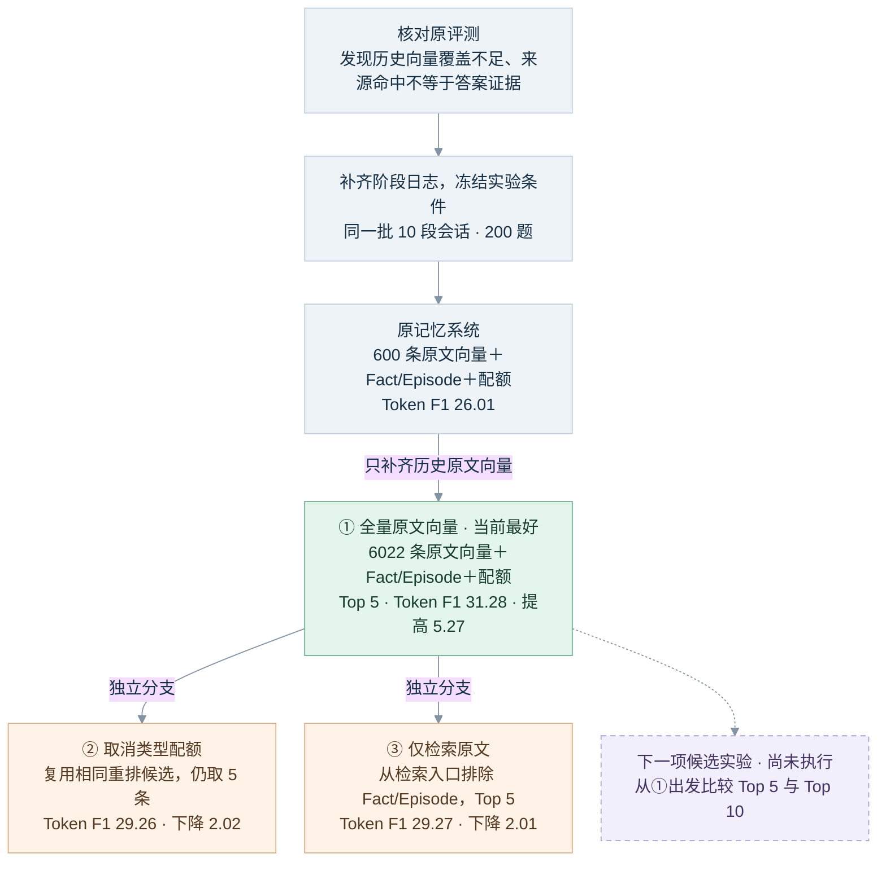

# LoCoMo 记忆系统消融进度与下一步计划

基于 2026 年 9 月 5 日原评测及其后完成的三轮对照，更新于 2026 年 9 月 6 日。本次更新汇总实验进度、Oracle 分类对比、结论边界及下一步优先级，没有重新调用模型或修改记忆数据库。

当前已测方案中，**全量原文向量＋Fact/Episode＋现有类型配额，Top 5** 的总体 Token F1 最高，为 **31.28**。相比原记忆系统提高 **5.27 分**，缩小原 Oracle 差距的 **21.22%**，仍相差 **19.57 分**。Token F1 是文本重合度，不是正确率；此处“最高”仅针对这批 200 题的已测配置。

## 进度概览

- [x] 核对原始 200 题与数据库，纠正向量覆盖口径、来源命中口径和失分归因。
- [x] 补齐检索各阶段日志，保存候选内容、移除原因及实际注入内容。
- [x] 完成全量原文向量对照：200 题，F1 **26.01→31.28**。
- [x] 完成取消类型配额对照：200 题，F1 **31.28→29.26**。
- [x] 完成纯原文对照：200 题，F1 **31.28→29.27**。
- [x] 对齐 Oracle 分类结果，明确当前结论与尚缺结果。
- [ ] 下一项建议：Top 5 与 Top 10 对照，并复核分数发生变化的题；**尚未执行**。
- [ ] 后续按需要开展：组件分拆、多跳分步检索、独立会话验证及完整成本测量。

当前目标是以最小改动缩小与 Oracle 的差距。下文列出的待验证项是完整清单，不要求立即全部执行；优先做能够直接影响下一步取舍的实验。

## 实验流程

无记忆 **2.72**、直接提供标准证据的 Oracle **50.85** 是原评测的参考端点，后续没有重跑 Oracle。②和③都以①的 31.28 为对照，**不是先取消配额，再继续删除摘要**。

## 共同控制与复现

- 使用同一批 10 段会话、200 题及其冻结的问题顺序；回答模型为 Qwen/Qwen3.6-35B-A3B，temperature=0、关闭 thinking，提示词及回答上限 256 保持一致。
- BM25 与向量检索每路候选 20，最终 Top 5，配置预算 2000；三轮正式实验均没有预算删条或文本截断。预算按现有实现换算为字符限制，并非精确的 tokenizer 截断。
- 共享缓存查询向量和原路由决策；不重新生成 Fact/Episode，不聚合访问反馈。实验在副本或冻结追踪上完成，源文件哈希核验未变。
- 追踪覆盖 BM25、向量、融合、Exchange 展开、重排去重、最终选择与实际注入；保存候选内容、来源、分数与移除原因。
- 第一轮先行运行发现 FTS 重插入改变并列顺序，未用其作为正式结果。正式 `03` 固定两组 BM25 候选；全量组复用了先行运行中完全相同的问题、上下文与答案。
- 第一轮基线 196 题上下文与历史完全一致，4 题重答后的逐题 F1 与历史相同。后两轮对上下文不变的题复用答案，分别为 31 题、7 题。
- 第一轮 35 题上下文相同但有 2 题因表达变化影响评分；统一复用这些基线答案后的敏感性结果为 31.50，不改变全量向量改善的方向。

## 三轮实验回答了什么

| 实验 | 实际改动 | 可支持的结论 | 尚不能支持的结论 |
|---|---|---|---|
| ① 全量原文向量 | 原文消息向量 600→6022；Exchange 覆盖 300→3011；保持摘要、配额等条件 | 历史原文的语义检索覆盖是一个有效优化方向 | 全量向量能消除全部漏召回；冷热存储分层本身必要 |
| ② 取消类型配额 | 复用①的重排候选序列，直接取前 5；不按 final_score 重新全局排序 | 当前配额在这批题上比直接取消有更高总体 F1 | 动态路由分类器必不可少；现有配额比例最优；所有丢证据均由配额造成 |
| ③ 纯原文 | 在 BM25/向量 Top 20 之前排除 198 个 Fact 和 227 个 Episode；保留全量原文向量 | 当前摘要层与原文互补，移除摘要层后总体 F1 下降 | Fact、Episode 各自都有净收益；摘要对每一题都有帮助；所有记忆机制都有必要 |

③保留原选择器，所有候选均为 chat 时由补位逻辑填满 5 条。移除摘要会自然改变 BM25 语料统计，因此测量的是移除摘要检索层的整体影响，不能只解释成“答案上下文少了几条摘要”。

## 总体与证据覆盖结果

| 配置 | Token F1 | 最终直接命中标准原文的问题／197 |
|---|---:|---:|
| 原记忆系统 | 26.01 | 53 |
| 全量原文＋摘要＋配额 | **31.28** | 92 |
| 全量原文＋摘要，取消配额 | 29.26 | 92 |
| 仅全量原文 | 29.27 | **118** |

直接原文命中要求完整标准原文实际出现在注入内容中；它不把摘要内的有效信息计入。因此不能单凭此表判断哪组拿到了更充分的答案证据，也不能把摘要来源命中当作答案内容已保留。

在全量混合组，有 **66 题**在重排之后仍有标准原文，但最终选择后失去全部标准原文。这个结果定位到了最终选择阶段的损失，却不能把损失全部归给类型配额；Top 5 也在限制可注入条目。

## 分类结果与 Oracle 对比

| 问题类别 | 原记忆 | 全量＋摘要＋配额 | 取消配额 | 仅全量原文 | Oracle |
|---|---:|---:|---:|---:|---:|
| 总体（200 题） | 26.01 | **31.28** | 29.26 | 29.27 | 50.85 |
| 单跳 Single-hop（50 题） | 33.91 | 42.60 | 38.64 | **53.66** | 75.65 |
| 多跳 Multi-hop（52 题） | 22.18 | **29.18** | 27.27 | 22.60 | 54.84 |
| 时间 Temporal（56 题） | 27.62 | **30.09** | 28.69 | 20.73 | 32.71 |
| 开放域 Open-domain（42 题） | 19.22 | **21.99** | 21.31 | 19.87 | 40.57 |

粗体标出各行已测检索方案中的最高分；Oracle 是直接提供标准证据的参考结果，不参与检索方案排名。总体为按题平均，各类别题数不同，不是四个分类分数的简单平均。

相对当前全量混合方案，与 Oracle 的差距分别为：单跳 **33.05 分**、多跳 **25.66 分**、时间 **2.62 分**、开放域 **18.58 分**。单跳具体属性召回、多跳证据组合值得继续关注；时间类接近这次 Oracle 成绩，但 Oracle 自身也只有 32.71，仍需区分日期推理错误和日期表达造成的评分损失。Oracle 是当前模型、提示词及评分下的参考成绩，不能作为理论硬上限。

纯原文更容易保留一些具体细节；摘要在部分属性整理、时间解析和跨轮信息上提供帮助。这是值得继续验证的解释，不能直接把评测类别当作线上可用的路由标签。

## 为什么取消配额和移除摘要的总分几乎相同

两组总体 F1 分别为 29.26 和 29.27，只差约 0.01 分，但分类结果不同：纯原文单跳为 53.66，高于取消配额的 38.64；取消配额多跳、时间类分别为 27.27、28.69，高于纯原文的 22.60、20.73。接近的总分来自不同类别上的得失相互抵消，不表示两种机制等价，也不表示两组答对的是同一批题。

两项改动发生在不同阶段。取消配额仍然混合检索摘要和原文，只改变最终选择；纯原文则在检索入口排除摘要，改变可进入候选池的内容。现有配额可能通过保护摘要与原文的组合产生收益，这是待验证的机制解释。不能把两项单独消融的降分简单相加，声称配额与摘要各自提供完全独立的收益。

## 当前决策与最近一步

**后续实验基线保留全量原文向量、Fact/Episode 与现有配额。** 暂不因个别案例取消全部配额，也不因原文直接命中更多而移除全部摘要。

建议优先执行以下两项，目前均未启动：

1. **Top 5→Top 10 对照。** 从全量混合组出发，复用冻结的问题、查询向量、路由和上游候选，保持候选上限、配额规则、模型及预算不变，只调整最终条数上限。配额会按 K 缩放，应保存两组实际类型组成；固定预算下最终未必真的能注入 10 条，因此同时记录实际条数、预算删条和截断。
2. **复核这次分数变化的题。** 检查实际注入内容能否支持答案，区分真实错误、同义表达、日期格式差异与日期推理错误。保留原 Token F1，不用局部复核替代完整的 200 题评分结论；初期不要求先对全部题完成语义判分。

Top 10 的依据是已有 66 题在重排后有标准原文、最终却全部失去，但不能预期救回全部 66 题：有些证据可能仍排在更后面，或受类型选择及预算影响。

根据结果决定后续动作：如果证据充分性和回答结果改善，再检查增加的 Token 与延迟是否可接受；如果只增加上下文而无净收益，就继续定位排序和证据选择的问题。多跳分步检索放在简单方案之后；路由与摘要分拆主要服务于简化系统及降低成本，当前暂缓。候选方案确定后，再补独立会话与稳定性验证。

## 仍缺少的结果

| 待验证项目 | 为什么要测／影响什么决定 | 当前优先级与状态 |
|---|---|---|
| 有效证据判定＋语义、日期评分 | 来源命中不能证明答案被保留，表达差异又会改变 F1。复核能避免把有效改动误判为退步，并区分该改检索、推理还是评分。它本身不是提分改动 | 优先随下一项实验复核变化题；完整 200 题补充评分待做 |
| Top 5 与 Top 10 对照 | 直接针对最终选择阶段已观察到的证据损失，是改动较小的候选优化。结果决定是否值得扩大最终容量 | 下一项配置实验，待执行 |
| 动态路由与固定配额；Fact/Episode 分拆 | 分别检验路由本身、Fact、Episode 的贡献，决定能否减少路由调用或简化摘要层；现有两项消融没有单独回答这些问题 | 当前暂缓，按简化与成本目标再做 |
| 多跳分步检索 | 单次检索可能只找到问题的一部分，增加条数不一定补齐另一部分。比较拆分子问题、分别检索再合并，决定增加流程与调用成本是否值得 | 简单方案之后按失败题决定，待执行 |
| 独立会话、重复测量和完整成本 | 持续在同一批题上选配置可能只适合这批题。验证泛化、稳定性及构建/检索/回答总代价，决定能否推广使用 | 候选方案确定后验证；无需每次探索都完整重测 |

这些结果尚未完成。原来的分阶段日志缺口已经补上，但逐题答案证据充分性和补充评分还没有形成完整的 200 题评估。当前数据也未验证遗忘、冲突更新等机制，不能用它们直接解释本次剩余失分。

已有的部分成本结果：纯原文对应的 200 个答案输入＋输出 Token 为 **157,546**，混合方案为 **188,877**，下降 **16.59%**。这只包含回答阶段，按缓存答案的实际调用来源计数；不包含摘要构建、向量或路由，不是各轮新增支出。现有库也没有完整的摘要生成 Token 或费用记录。

## 冷区与生产实现的当前认识

现有冷热原文都保存在同一个 SQLite 中，没有独立的冷存储或缓存分层；当前冷转移会删除原文向量，保留原文及词面检索能力。全量向量实验在副本中扩大热窗口实现覆盖，验证的是保留历史原文语义检索能力的价值，没有验证冷热分层本身的价值。

“向量搜索命中后再读取原文”是按需读取，本身不要求冷热分区。如果未来没有不同的存储位置、缓存或读取成本，冷热标签的实际作用有限；可以把统一保存原文、保留完整索引、按需注入证据作为设计方向。生产生命周期如何保留历史向量仍未实施，现有默认热区仍为 30。

## 依据

- [原评测汇总与 Oracle 分类分数](/E:/AgentLearnProject/simple_cc/eval/locomo_refined/runs/qwen36-full-200-oracle-20260905-021445/batch-summary.json)
- [全量向量正式实验报告](/E:/AgentLearnProject/simple_cc/eval/locomo_refined/runs/qwen36-full-vector-ablation-20260905-03/REPORT.md)
- [取消类型配额报告](/E:/AgentLearnProject/simple_cc/eval/locomo_refined/runs/qwen36-no-type-quota-top5-20260905-01/REPORT.md)
- [纯原文报告](/E:/AgentLearnProject/simple_cc/eval/locomo_refined/runs/qwen36-raw-only-top5-20260905-01/REPORT.md)
- [原始评测审计结果](/E:/AgentLearnProject/simple_cc/output/audit_memory_eval_20260905.json)

生产默认热区仍为 30；以上是副本实验结果，不能表述为全量原文向量已在生产生命周期中保留。
